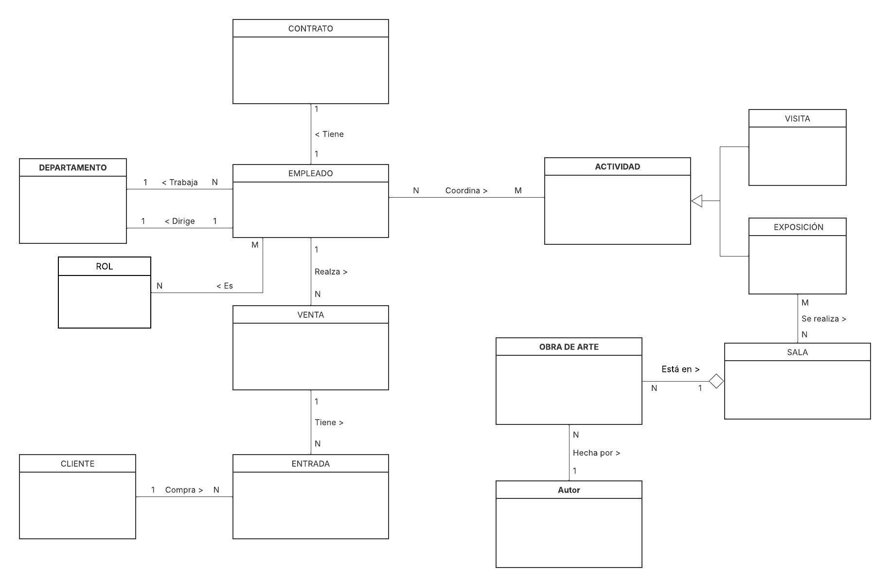
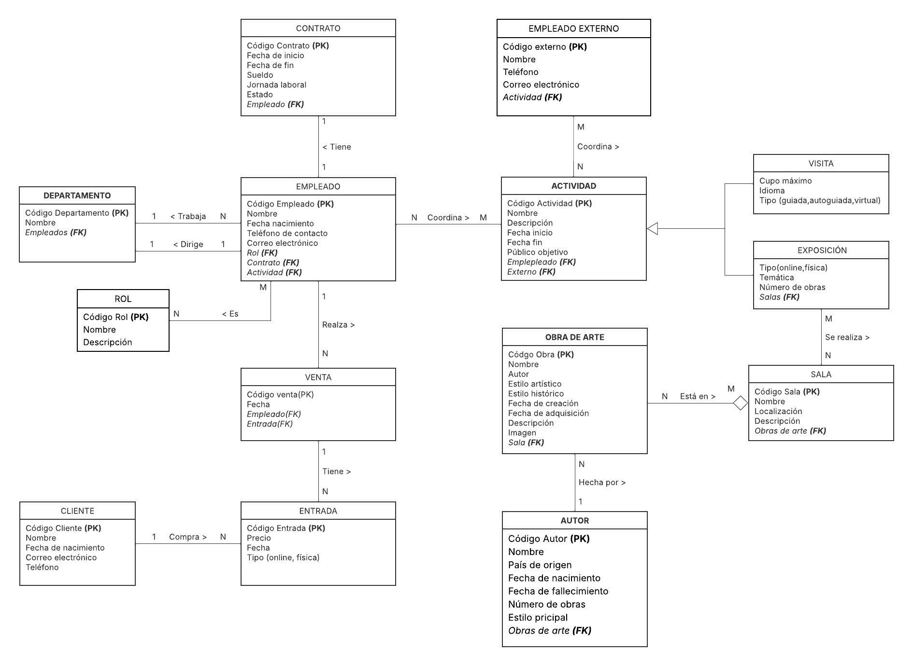
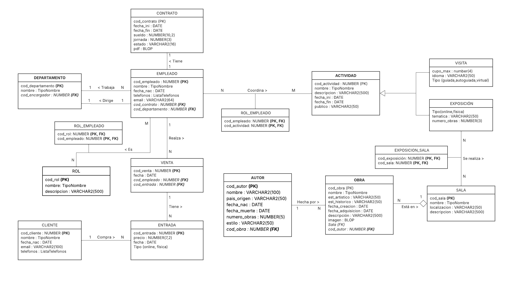

# Documentación

## Enlaces documentación

Enlace a la documentación google docs:

<https://docs.google.com/document/d/17Z-Yq4QoVhbS-JzMEXUA8WNU_7ed_3M6sKpxKyomAXE/edit?tab=t.0#heading=h.mgqnarfdh6fj>

Enlace a el diagrama:

- drawio
<https://drive.google.com/drive/folders/1baVLCYSYAJ-rACc3HerbEblit2D5PNXX>

- lucichart
<https://lucid.app/lucidchart/d3575e16-4b33-4738-83a1-c9c34ebe9366/edit?beaconFlowId=F8FBBD11452FDF19&invitationId=inv_2f0cf1d8-497b-49c9-a32b-389c23929478&page=HWEp-vi-RSFO#>

Enlace a Mockups:

<https://balsamiq.cloud/sy1lqha/pmah21v/r37A4>

## Diseño

### Diagrama conceptual

### Diagrama lógico

### Diagrama físico

